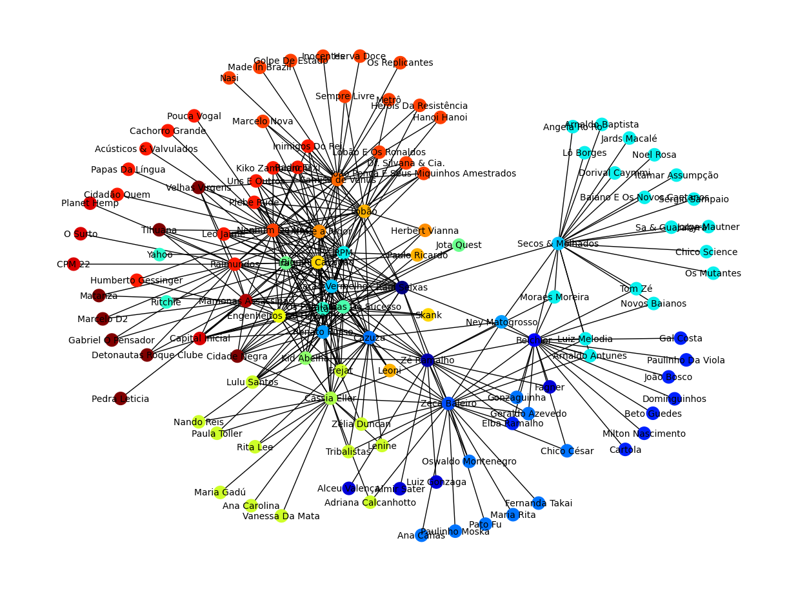
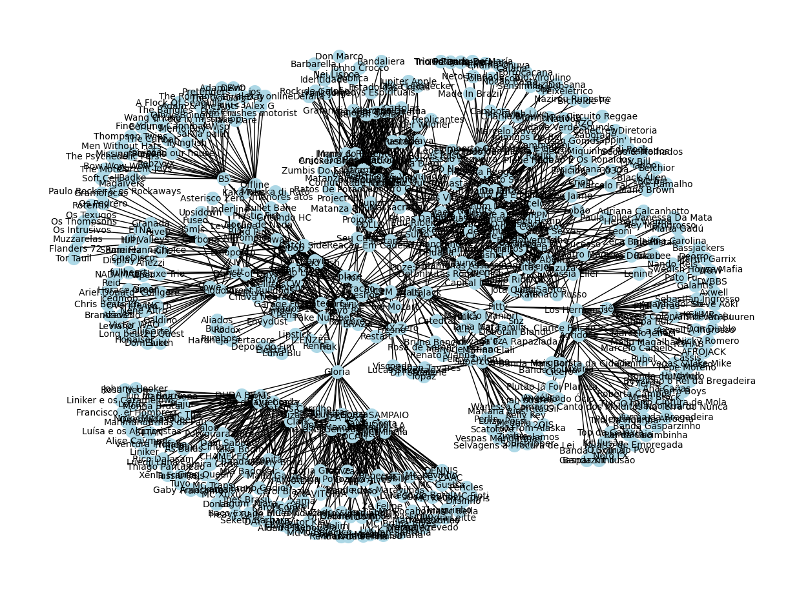
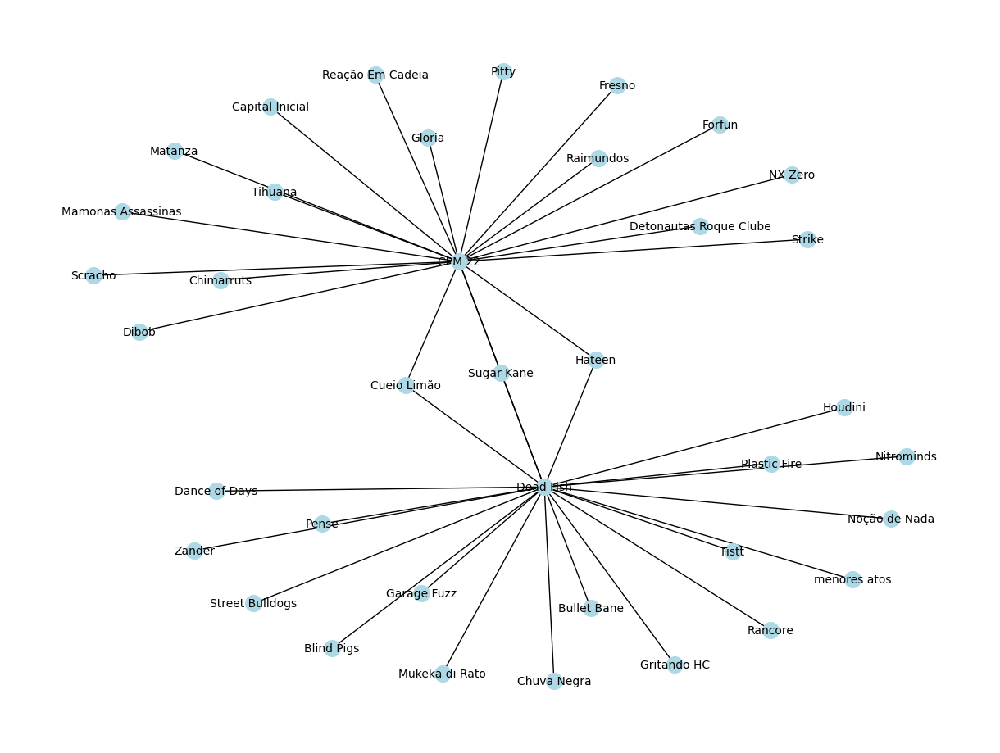

# Temas:
 - Grafos1
 


## Grafos Artistas do Spotify

**Número da Lista**: X<br>
**Conteúdo da Disciplina**: XXXXXXXXXX<br>

## Alunos
|Matrícula | Aluno |
| -- | -- |
| 19/0048760  | Wellington Jonathan de Souza Rodrigues |


## Sobre 
O objetivo do código é criar um grafo que representa as conexões entre artistas musicais relacionados no Spotify. Esse grafo permite visualizar como os artistas estão conectados com base em suas relações de similaridade musical. Os principais objetivos do código:

Conexões de Artistas Relacionados: O código utiliza a API do Spotify para pesquisar e obter informações sobre artistas musicais. A partir de um artista inicial especificado, ele busca artistas relacionados a esse artista e cria conexões no grafo entre o artista inicial e seus relacionados.

Exploração de Profundidade ou Largura: O código oferece a flexibilidade de escolher entre busca em profundidade (DFS) ou busca em largura (BFS) para criar o grafo. A escolha da busca determina a ordem em que os artistas relacionados são explorados.

Visualização do Grafo: O código utiliza a biblioteca NetworkX para criar o grafo e a biblioteca Matplotlib para plotá-lo. O grafo resultante é exibido em uma janela gráfica para que você possa visualizar as conexões entre os artistas.

Exportação do Grafo: Além da visualização, o grafo é exportado em formato JSON para que você possa salvá-lo e utilizá-lo posteriormente em outras análises ou aplicações.

Em resumo, o código permite que os usuários explorem as relações musicais entre artistas no Spotify, criando grafos que representam essas conexões. Isso pode ser útil para descobrir artistas relacionados, identificar influências musicais e realizar análises de redes musicais.

## Screenshots
Adicione 3 ou mais screenshots do projeto em funcionamento.

## Instalação 
**Linguagem**: Python 3.x<br>
**Framework**: jupyter-notebook<br>
Descreva os pré-requisitos para rodar o seu projeto e os comandos necessários.


# Criação de um Grafo de Artistas Relacionados no Spotify

Este guia descreve como usar o código Python para criar um grafo de artistas relacionados no Spotify e visualizá-lo.

## Pré-requisitos

Certifique-se de ter as seguintes ferramentas e bibliotecas instaladas:

- Python 3.x (https://www.python.org/downloads/)
- Spotipy (biblioteca para acessar a API do Spotify): 
- NetworkX (biblioteca para criar e manipular grafos): 
- Matplotlib (biblioteca para plotar o grafo): 

```
pip install spotipy
pip install networkx
pip install matplotlib

```
## Configuração

1. Crie um aplicativo no [Spotify Developer Dashboard](https://developer.spotify.com/documentation/web-api/concepts/apps).
2. Obtenha o seu `CLIENT_ID` e `CLIENT_SECRET` do aplicativo criado.
3. Substitua `'seu_client_id'` e `'seu_client_secret'` no código Python pelos seus valores.

## Utilização
1. Abra o arquivo grafo_spotify.ipynb no vscode. Utilize o jupyter-notebook no vscode acionando sua extensão.
2. Execute o código Python fornecido para criar o grafo de artistas relacionados. Certifique-se de definir o `artist_name` desejado e a profundidade (`depth`) da busca.
3. O grafo resultante será plotado e exibido na tela.
4. O grafo também será exportado em um arquivo JSON chamado "grafo_NomedoArtista.json" no diretório [GRAFO_SJON](./GRAFO_JSON).

## Exemplo

Aqui está um exemplo de código Python para criar um grafo de artistas relacionados a partir do artista "The Beatles" com profundidade 2:

```python
import spotipy
from spotipy.oauth2 import SpotifyOAuth
import networkx as nx
import json
import matplotlib.pyplot as plt

# Configurar as credenciais da API do Spotify
CLIENT_ID = 'seu_client_id'
CLIENT_SECRET = 'seu_client_secret'

# Resto do código...

# Exemplo de uso
artista_inicial = 'The Beatles'
grafo_artistas = criar_grafo_artistas_relacionados(artista_inicial, depth=2)
plotar_grafo(grafo_artistas)


``````


# Exemplo de Grafos 

## grafo 01


## grafo 02


## grafo 03


## grafo 04
